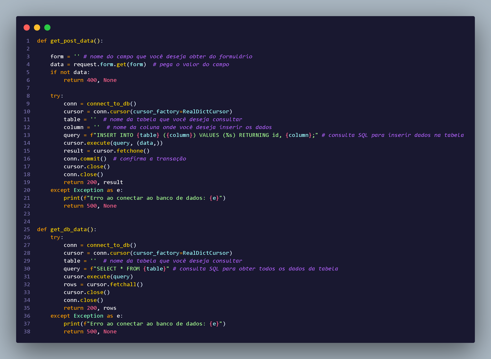
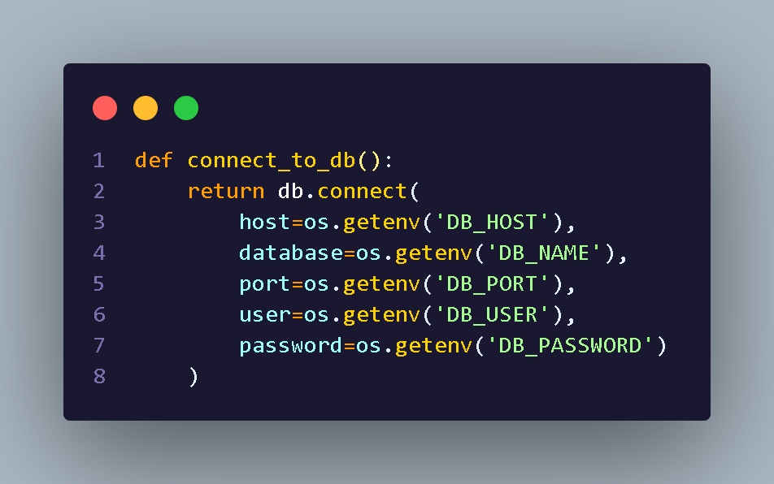
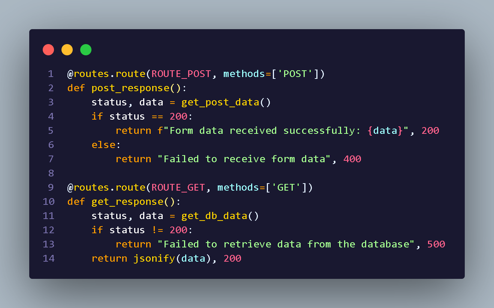

# Projeto Flask com PostgreSQL

## Visão Geral

Esta aplicação desenvolvida com **Flask** para receber dados via formulário, inserir esses dados em um banco de dados **PostgreSQL** e retornar o resultado da operação.

---

## Estrutura do Projeto

- `src/controllers/controller.py` — lógica de manipulação e inserção dos dados.
- `src/database/db.py` — conexão com o banco PostgreSQL.
- `src/routes/route.py` — rotas HTTP.
- `.env` — variáveis de ambiente para configuração.
- `requirements.txt` — dependências Python.

---
## Configuração

### Instalação de Dependências

instale as depedencias para usar o projeto

```bash
pip install -r requirements.txt
```

### Variáveis de Ambiente

Renomear o arquivo `.env.exemple` para `.env`
ou
Crie um arquivo `.env` com as variáveis:

```
DB_HOST=localhost
DB_PORT=5432
DB_NAME=nome_do_banco
DB_USER=usuario
DB_PASS=senha
```
---

## Funções importantes 

### 📂 Controller

`src/controllers/controller.py` — lógica de manipulação e inserção dos dados.  
  
🔗 [Documentação das funções do Controller](assets/functions/functionsController.md)

---

### 🗄️ Database

`src/database/db.py` — conexão com o banco PostgreSQL.  
  
🔗 [Documentação das funções de Database](assets/functions/functionsDatabase.md)

---

### 🌐 Routes

`src/routes/route.py` — rotas HTTP.  
  
🔗 [Documentação das funções de Routes](assets/functions/functionsRoutes.md)

---

> ℹ️ Obs: ajuste os caminhos conforme a estrutura final do seu projeto.


---

## Executar a Aplicação

```bash
python -m src.main.app   
```


